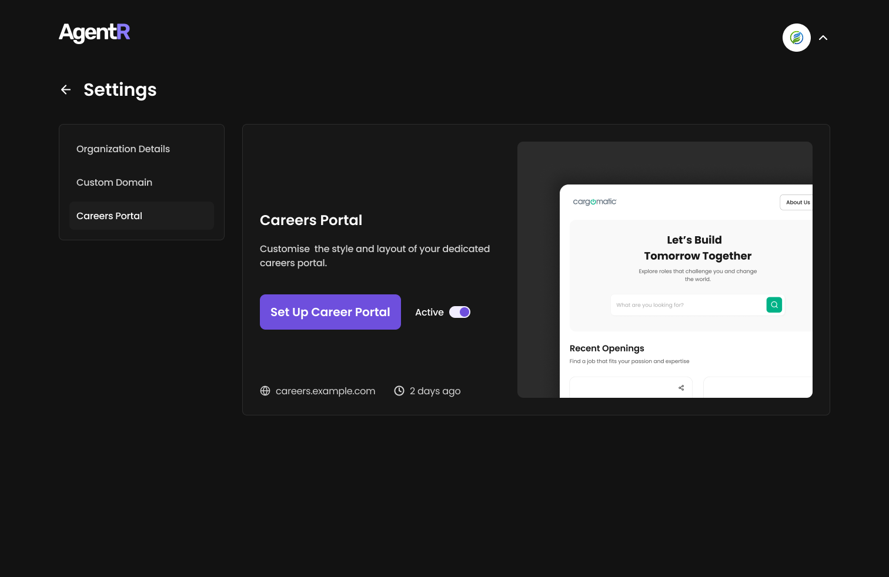

# 🚀 Setting Up Your Career Portal

> ⚠️ **Note**: Please complete the **Domain Configuration** first (via **Settings → Custom Domain**) if you haven’t already. This step is required to enable the **Career Portal Setup** option.

## Step 1: Access Portal Settings
1. Navigate to **Dashboard** → **Settings** (⚙️ icon)
2. Select **Careers Portal** from Organization Details

## Step 2: Customize & Activate Portal
 Watch this Step-by-Step Video Guide to Complete the Setup  👇

  <iframe
    src="https://app.supademo.com/embed/cmcitb4m900gw110i8fl558q6?embed_v=2&step=4"
    loading="lazy"
    title="AgentR ATS x LinkedIn Integration | Simplify Your Hiring Workflow"
    allow="clipboard-write"
    frameBorder="0"
    webkitallowfullscreen="true"
    mozallowfullscreen="true"
    allowFullScreen
    style={{
      position: 'absolute',
      top: 0,
      left: 0,
      width: '100%',
      height: '100%',
    }}
  />

