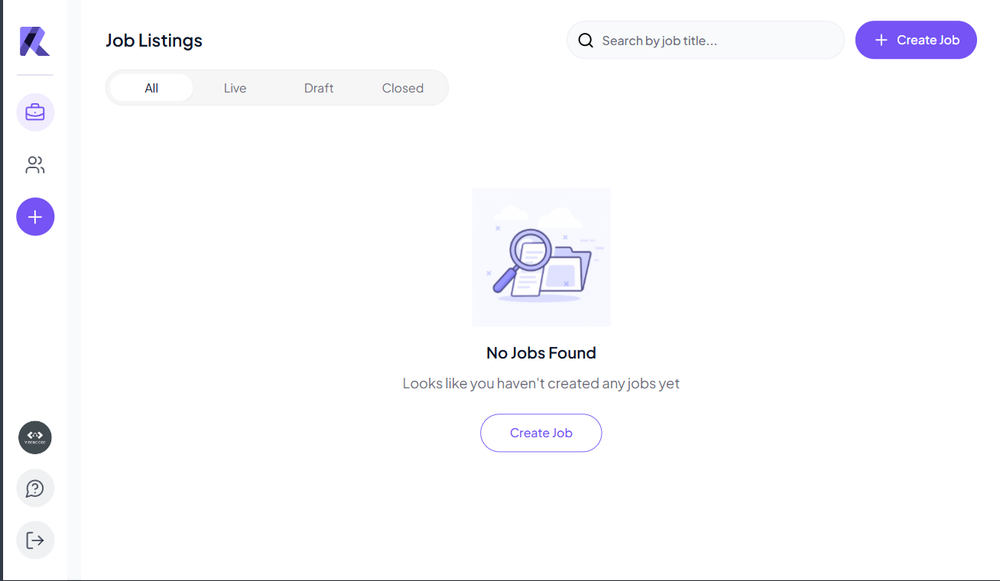
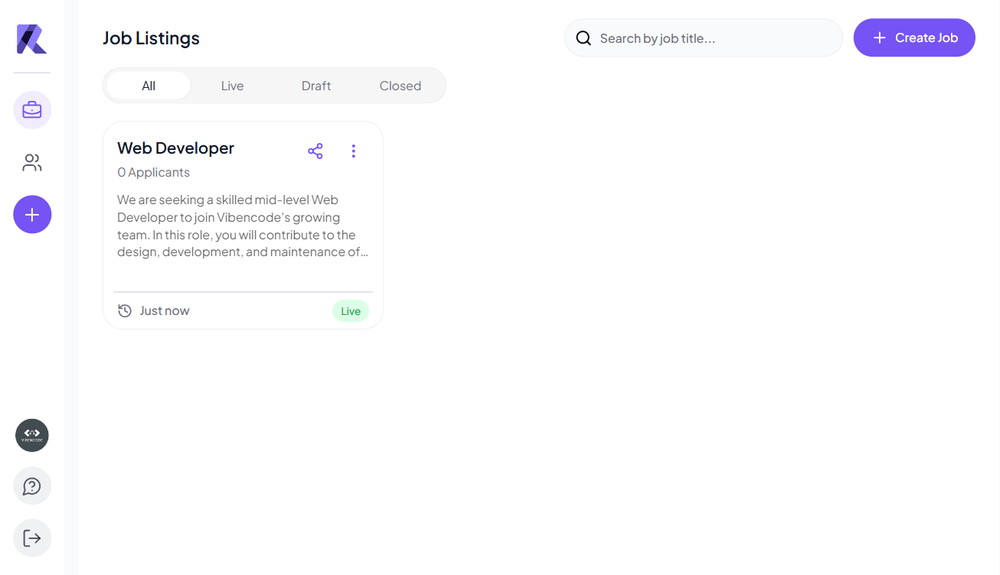

# 🚀 Create a New Job Posting
Follow the steps below to post a new job using the AgentR platform:

---

## 🧭 Step 1: Navigate to the Dashboard

Once your setup is complete, you can start creating job listings from your dashboard. This is where you manage all your job postings, track their status, and monitor hiring progress.If no jobs have been created yet, you will see an empty state with an option to create your first job.

- [Visit Dashboard](https://app.agentr.global/dashboard)

---

## ➕ Step 2: Click on **Create Job**

- Click the `+ Create Job` button on the top right.
- This will navigate you to the job creation form.

---

### ✍️ 3. Create a Job Post

Clicking on **+ Create Job** button will take you to a guided interface where you can quickly generate a job description. You can enter the role you are hiring for, and the platform will help you create a structured job post in minutes.
You can also select from suggested roles based on your hiring preferences to speed up the process.

  

---
### 📝 4. Add Job Details

In this step, you will provide key details about the job, including employment type, work location, and salary range. These details help define the role clearly and ensure better visibility to suitable candidates.Fill in the required information and proceed to the next step to continue building your job post.

  

---

### ✨ 5. Generate Job Description

In this step, you can create a detailed **job description** for the role. You can either write it manually or use the AI assistant to generate a structured and optimized description.Customize the tone, seniority level, and provide role details to help the AI generate more accurate and relevant content.

  

💡 Looking to craft a compelling job description? <a href="/essentials/job-description">Read our step-by-step guide →</a>

---
### 🤖 6. Analyze Job Description

In this step, the platform analyzes your **job description using AI** to ensure it is clear, complete, and well-structured. It reviews key sections such as the overview, responsibilities, and requirements to improve quality and effectiveness.
You can review the suggestions and make any necessary updates before moving to the next step.

  

---

### 🎯 7. Define Sorting Instructions

In this step, you can define what an ideal candidate looks like for this role. Specify key factors such as skills, experience, location, and industry preferences to help the platform identify the most relevant candidates.
These instructions are used internally to improve candidate matching and are not visible to applicants.

  

---

### ⚙️ 8. Configure Screening Settings

In this step, you can define how candidates will be screened for this role by customizing the assistant settings and selecting your preferred screening channels. You can choose options such as AI-powered web calls for video-based screening or AI phone calls for traditional voice screening.
You also have the option to personalize the assistant name and add custom screening questions to better evaluate candidates based on your specific requirements.

  

---

### 🚀 9. Job Published Successfully

Your job post is now live and ready to receive applications. You can share the job link across different platforms to attract candidates and start building your talent pipeline.Use the provided link to distribute your job posting and track applicants directly from your dashboard.

  

---

That’s it! You’ve successfully created and shared a job post using AgentR. 🎯
