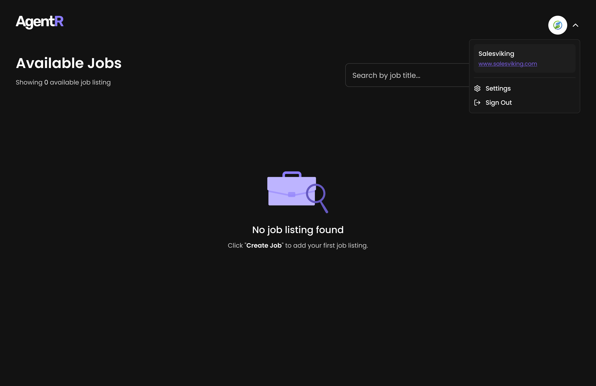
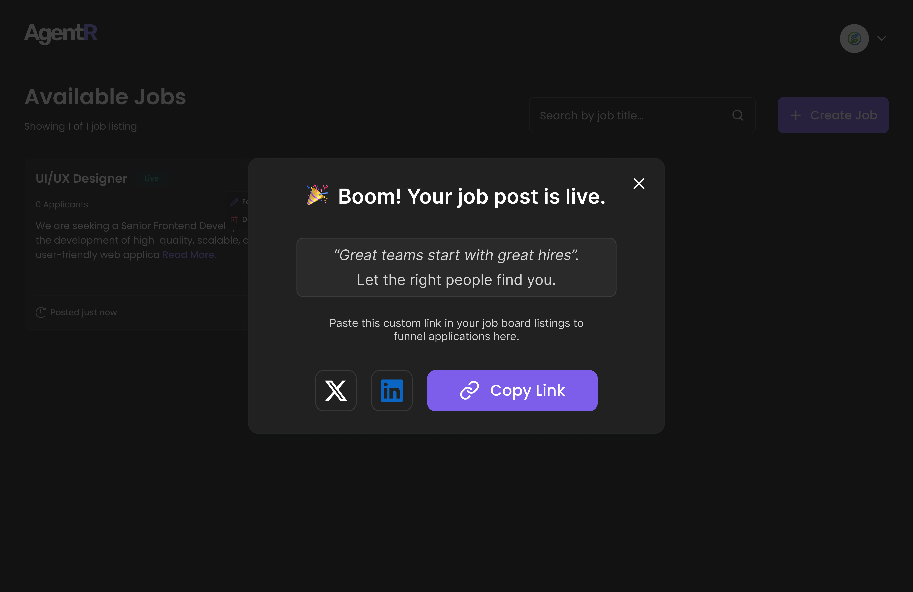

# 🚀 Create a New Job Posting
Follow the steps below to post a new job using the AgentR platform:

---

## 🧭 Step 1: Navigate to the Dashboard

- Visit [https://app.agentr.global/admin/dashboard](https://app.agentr.global/admin/dashboard)
- If there are no jobs posted yet, you'll see the message:
  
  > “No job listing found”

---

## ➕ Step 2: Click on **Create Job**

- Click the `+ Create Job` button on the top right.
- This will navigate you to the job creation form.

---

## 📝 Step 3: Add Job Details & Publish

- Enter the **Job Title**, e.g., `Front End Developer`.
- Write a clear and concise **Job Description** to outline responsibilities, requirements, and expectations.
- Once completed, click **Publish Now** to make the job live.
- You can also choose to **Save as Draft** if you prefer to publish later.

*Example of entering job details and publishing the post*

---

## ✅ Step 4: Job is Now Live

- A confirmation modal will appear saying:

  > “🎉 Boom! Your job post is live.”

- You’ll be provided with a custom job application link.
- Share the job via:
  - X (formerly Twitter)
  - LinkedIn
  - Or by copying the link directly.

---

That’s it! You’ve successfully created and shared a job post using AgentR. 🎯
