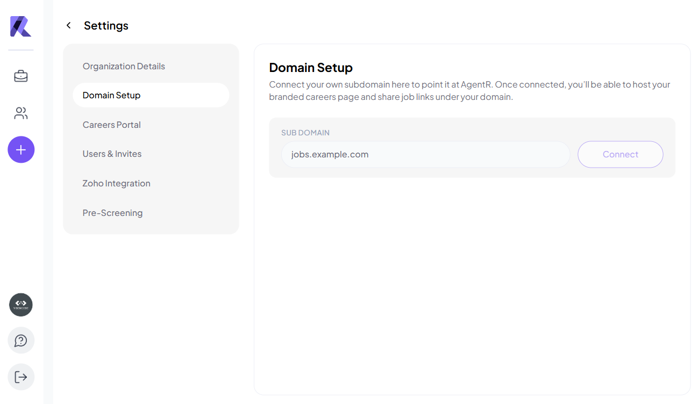
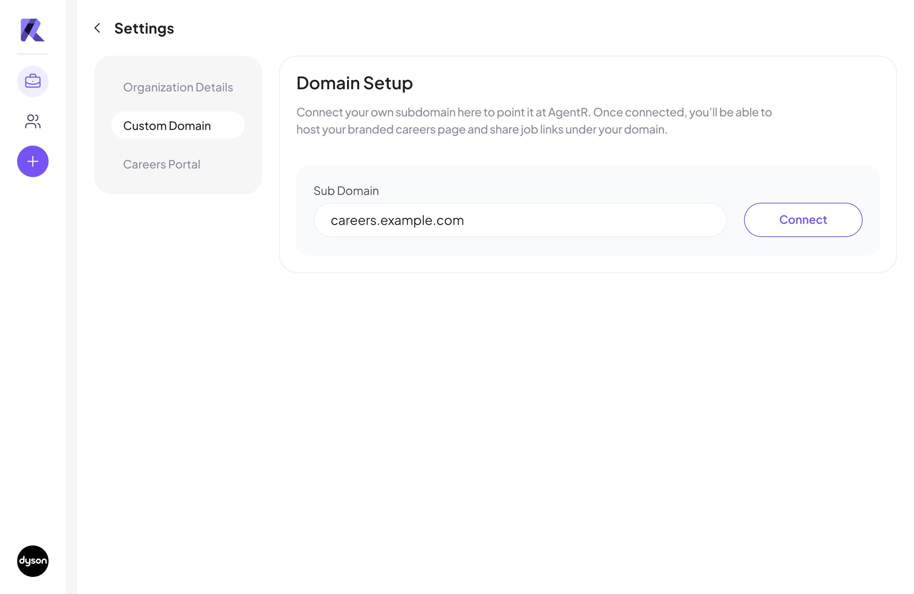
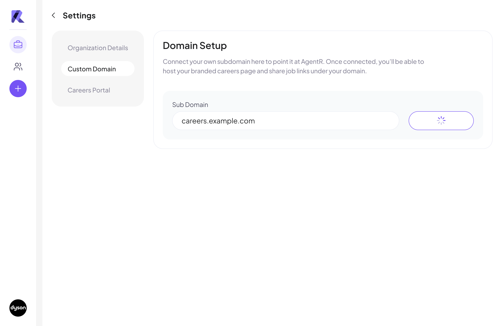
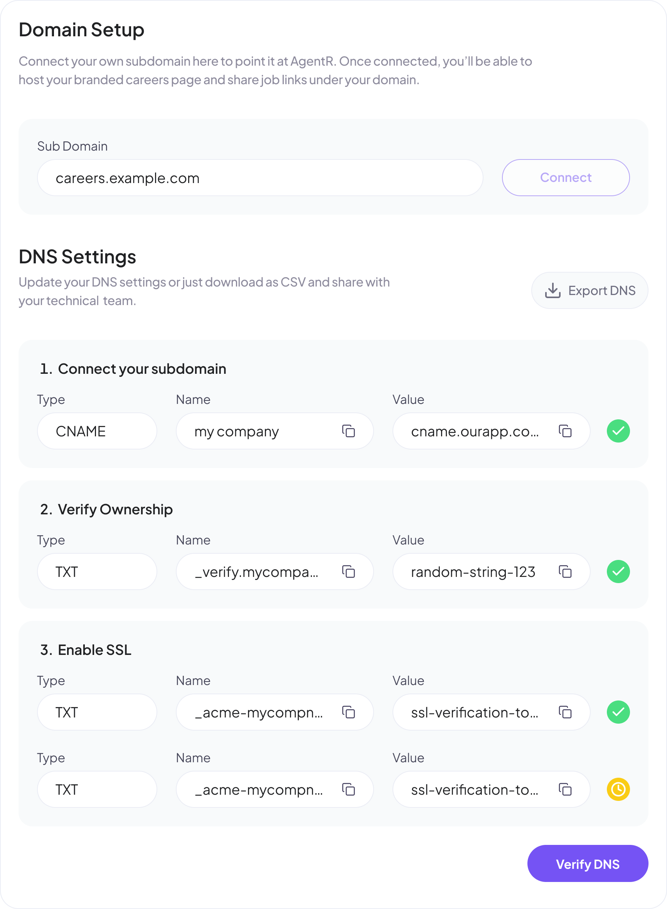
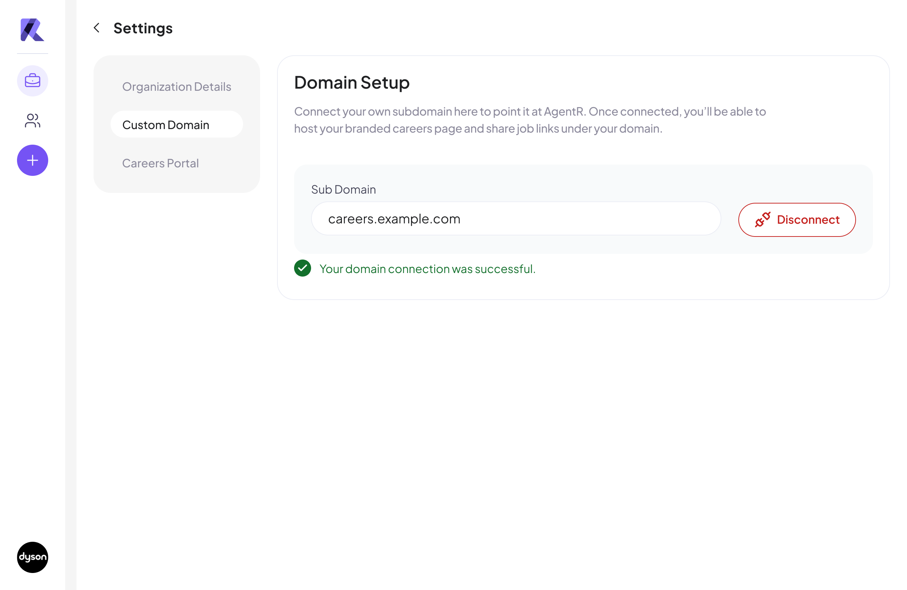
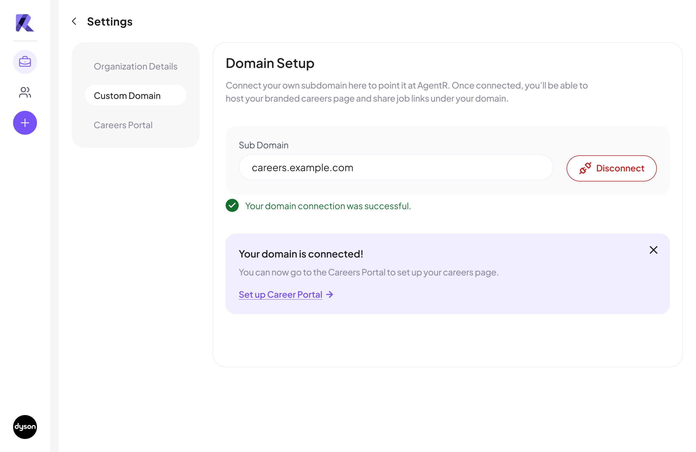

# 🌐 Custom Domain Setup

Configure a custom domain to host your branded careers page (e.g., `careers.yourcompany.com`) and share job links under your company's domain.

---

## 🛠️ Step 1: Access Domain Settings

1. Navigate to: **Settings (Organisation's Logo)** → **Domain Setup**
2. The domain configuration panel will appear:

---

## ✍️ Step 2: Enter and Connect Your Subdomain

1. In the **Sub Domain** field, enter your desired subdomain:
   - Example: `careers.yourcompany.com` or `jobs.yourcompany.com`

   

2. Click the **Connect** button.

> ⏳ Please wait while AgentR verifies your subdomain and prepares DNS records. This may take a few seconds.

---

## 🧾 Step 3: Update DNS Records

Once verification is initiated, you’ll see DNS settings that need to be configured:

- You can copy the records manually
- Or click **Export DNS** to download and share with your technical team

- How to Set Up DNS Records on Popular Domain Providers:

&nbsp;&nbsp;&nbsp;&nbsp;&nbsp;&nbsp;&nbsp; - [🔗 Hostinger DNS Guide](https://support.hostinger.com/en/articles/1583249-how-to-manage-dns-records-at-hostinger)
&nbsp;&nbsp;&nbsp;&nbsp;&nbsp;&nbsp;&nbsp; - [🔗 GoDaddy DNS Guide](https://www.godaddy.com/en-in/help/manage-dns-records-680)
&nbsp;&nbsp;&nbsp;&nbsp;&nbsp;&nbsp;&nbsp; - [🔗 Dynadot DNS Guide](https://www.dynadot.com/community/help/question/set-up-DNS)

- After DNS is configured, click the **Verify DNS** button.

*Example of DNS records generated after clicking "Connect"*

> ⚠️ Be sure all DNS records are added correctly. DNS propagation may take 24–48 hours depending on your provider.

- Once all records are validated, you’ll see a success message:
  > ✅ *Your domain connection was successful.*

This means your branded careers portal is now live at the configured subdomain.

## 🔌 Disconnecting Your Domain

1. Click **Disconnect** next to your domain
2. Confirm the prompt:
   > "Disconnecting will remove your custom careers page."
   > **Cancel** | **Yes, Disconnect**

---

