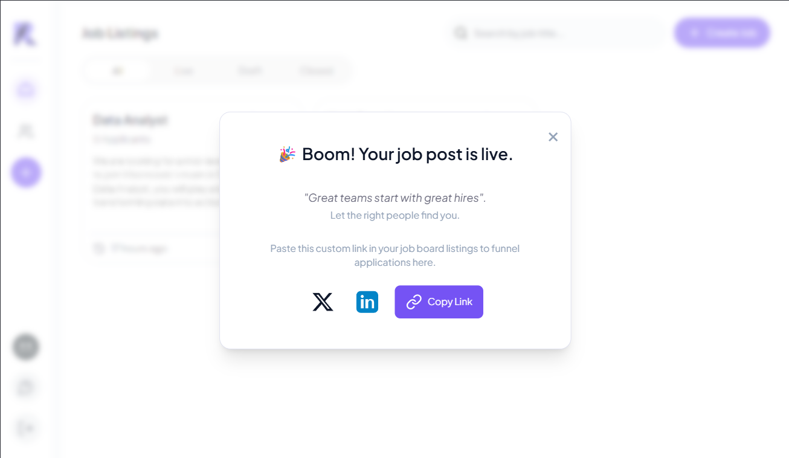

# 📢 Share Job Posts on LinkedIn

Easily promote your open roles by sharing job listings directly from the dashboard to LinkedIn. Reach a wider network of potential candidates with just a few clicks.

---

## 🧭 Step 1: Access Job Listings

1. Navigate to the **Job Listings** section from your main dashboard.
2. Each job appears as a card — for example:
   `UI/UX Designer • Live • 2 Applicants`

---

## 🚀 Step 2: Open the Share Popup

1. Click the **Share** icon (↗️) on the job card.
2. A popup will appear confirming that the job is live:
   - `"Boom! Your job post is live!"`
3. Within the popup, you'll see sharing options, including a **LinkedIn** button.

*Example of the share popup with LinkedIn sharing option*

---

## 💡 Why Share on LinkedIn?

Sharing your job posts on LinkedIn offers several key benefits:

- 🌍 **Wider Reach**: Tap into LinkedIn’s network of over 900 million professionals.
- 🎯 **Targeted Audience**: Connect with candidates based on industry, skills, or role.
- 🔄 **Employee Amplification**: Team members can reshare the post to increase exposure.
- 📈 **Faster Hiring**: Speed up your recruitment cycle by attracting more qualified applicants.
- 💼 **Brand Visibility**: Showcase your company culture and hiring momentum on your feed.

> Posting jobs directly from your dashboard makes it seamless to promote opportunities while maintaining your brand presence.

## 🎥 Watch the Interactive Demo

Experience how easy it is to share job posts on LinkedIn directly from your dashboard:

  <iframe
    src="https://app.supademo.com/embed/cmdoe4hhi14j69f96h4icwj0u?embed_v=2"
    title="AgentR ATS x LinkedIn Interactive | Simplify Your Hiring Workflow"
    loading="lazy"
    allow="clipboard-write"
    style={{ position: 'absolute', top: 0, left: 0, width: '100%', height: '100%' }}
    frameBorder="0"
    allowFullScreen

  />

---
